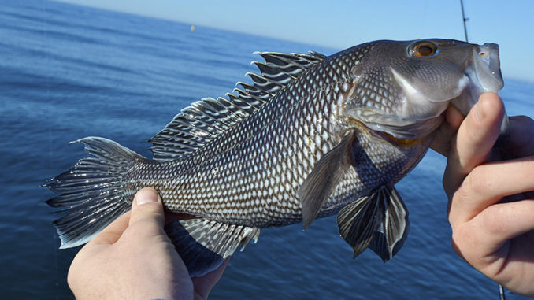
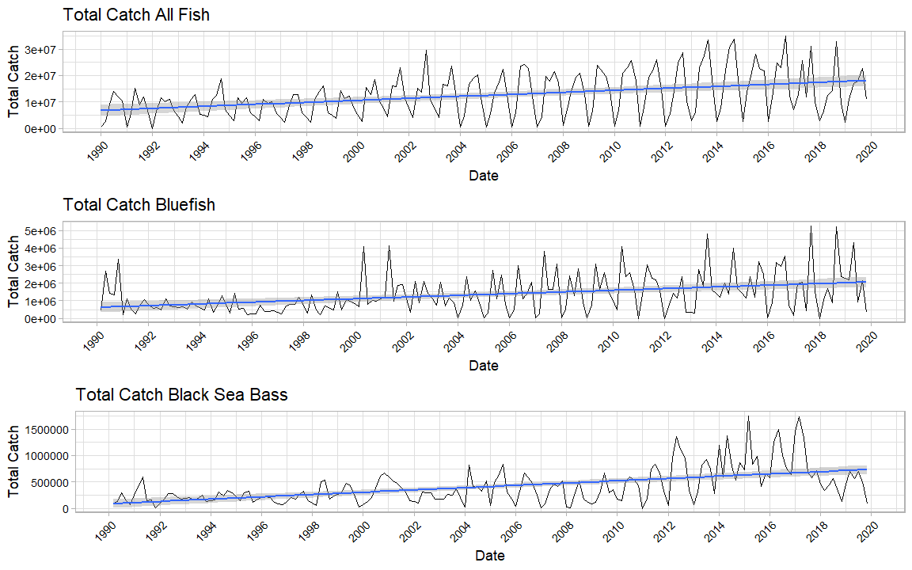
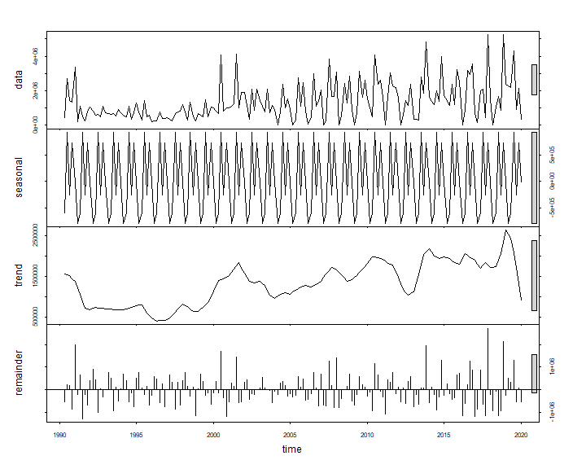
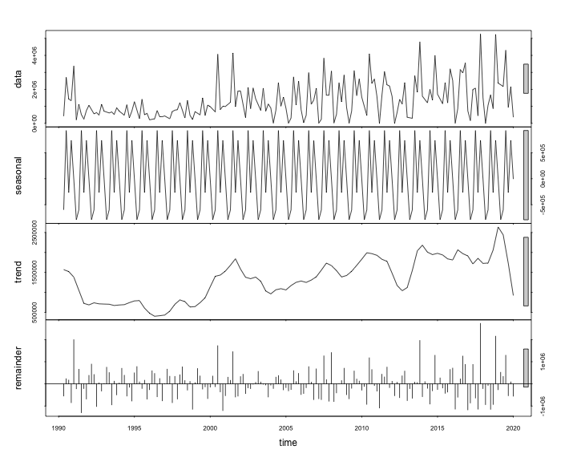
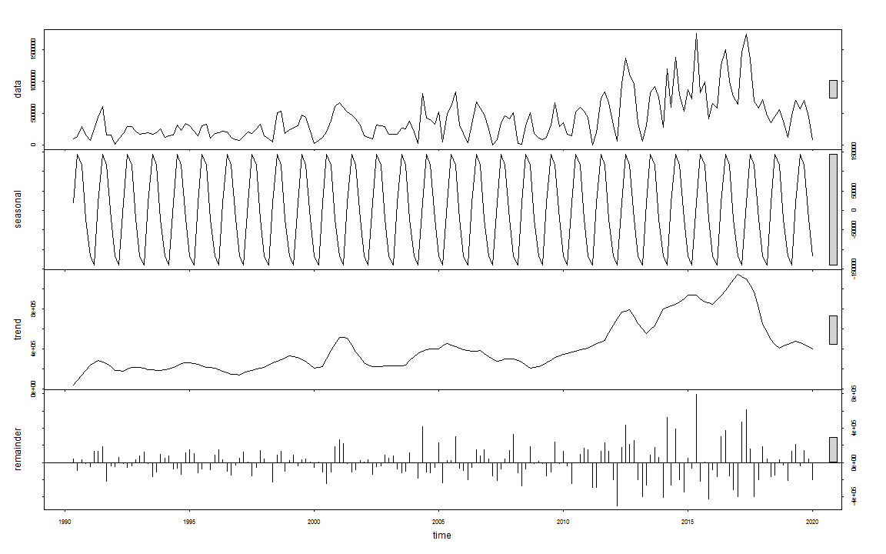
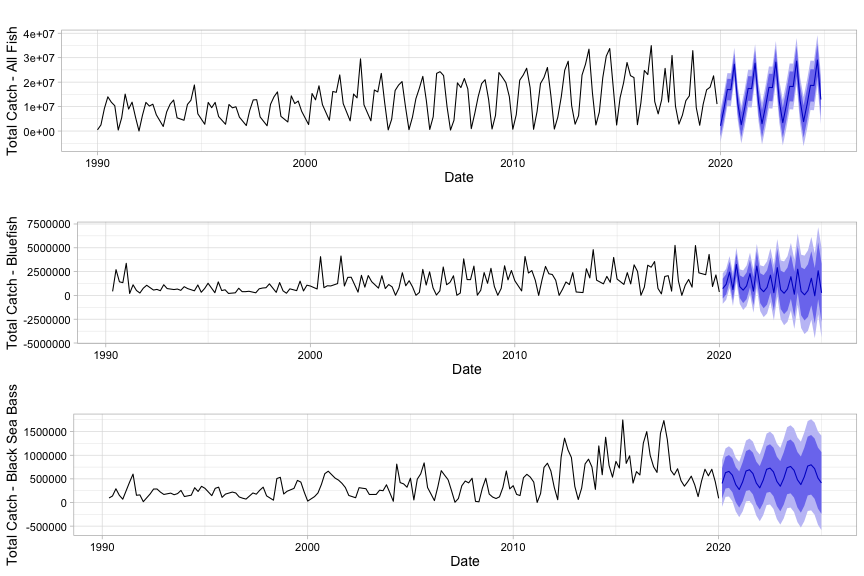

What's the Catch? Recreational Fishing Trends in North Carolina (1990-2019)
========================================================
author: Ardath Dixon, Annie Harshbarger, Eva May
date: Spring 2021
autosize: true



Data and Research Questions
========================================================


Data retrieved from NOAA Marine Recreational Information Program download query tool

- Recreational fisheries catch totals for North Carolina, 1990-2019

- All species, bluefish (*Pomatomus saltatrix*), and black sea bass (*Centropristis striata*) 

- Multiple modes of fishing and areas where fishing occurred

- Organized in waves (2-month periods)


Research questions

- Are there changes in the amount of these fish caught over time?

- Do these trends differ for bluefish, black sea bass, and all species combined?

A Preview of the Data
========================================================


 


Original Dataset


```
# A tibble: 6 x 8
   YEAR  WAVE SUB_REG    ST    SP_CODE MODE_FX AREA_X TOT_CAT
  <dbl> <dbl>   <dbl> <dbl>      <dbl>   <dbl>  <dbl>   <dbl>
1  1990     1       6    37 8710010201       3      1 203578.
2  1990     1       6    37 8713040113       3      1   9693.
3  1990     1       6    37 8713040115       3      1   3987.
4  1990     1       6    37 8777020101       7      5 153212.
5  1990     1       6    37 8835440102       7      1  82510.
6  1990     1       6    37 8835440601       7      1  25388.
```

Wrangled Dataset


```
        DATE TOT_CAT_ALL
1 1990-01-01    484714.5
2 1990-03-01   2485857.2
3 1990-05-01   9215674.2
4 1990-07-01  13992342.3
5 1990-09-01  11808541.6
6 1990-11-01  10354163.5
```


Total Catch 1990-2019
========================================================




Time Series Trends - All Fish
========================================================



Time Series Trends - Bluefish
========================================================



Time Series Trends - Black Sea Bass
========================================================



Monotonic Trend Analysis
========================================================

Seasonal Mann-Kendall Test

All species


```
tau = 0.49, 2-sided pvalue =< 2.22e-16
```

Bluefish


```
tau = 0.324, 2-sided pvalue =8.7489e-10
```

Black sea bass


```
tau = 0.41, 2-sided pvalue =8.4377e-15
```

For both individual species and all species combined, **reject the null hypothesis that there is no trend.

Forecasting
========================================================



Discussion
========================================================
Text of why stuff happened.
[note:just ideas/scattered thoughts below]
forecasting: note that Holt Winters weighs more recent data more heavily than older data (e.g. bluefish total trend is postiive but forecasted trend looks negative) and predicts data without much noise in it, which is unlikely to be the case IRL. Useful visualization but inaccurate bc of complexities in fishing data. (could go above w forecasting slides)

general trends: Seasonal trends look different between all species, bluefish, and seabass. Can be from different fishing seasons and fish availability throughout the year. Overall positive trend in all fish species catch is due to [how many?] different species' influence, so blue and BSB catch won't necessarily align with this. but we do see a postiive trend in each one, albeit to differing extents. Irregularities in these data can occur due to shifts in policy, e.g. recreational catch limits or changes in limits. Recreational catch data are also estimates based on surveys - they use the best available science from NOAA but ultimately cannot 100% accurately reflect actual catch numbers, which would require accurate self reporting from every rec fisher in NC. 

