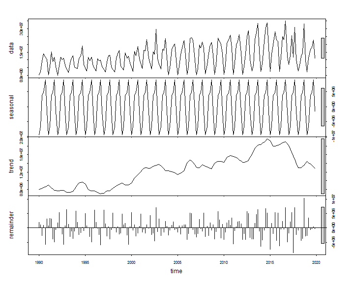
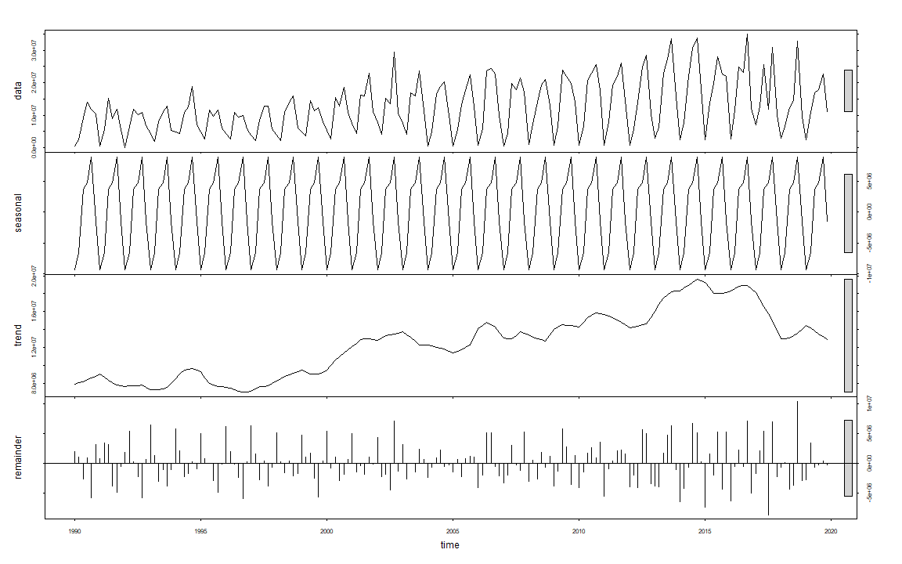
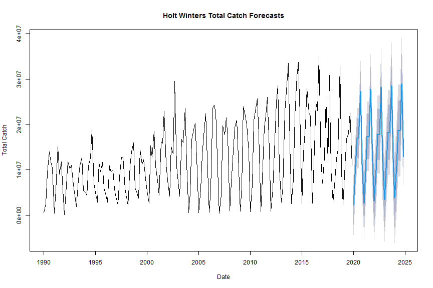

Trends in Recreational Fishing in North Carolina (1990-2019)
========================================================
author: Ardath Dixon, Annie Harshbarger, Eva May
date: Spring 2021
autosize: true

First Slide
========================================================

Overall description

- What the data is
- Where we got it
- What we hope to show

Slide With Code
========================================================


 


```r
head(fish.tidy)
```

```
# A tibble: 6 x 6
  DATE       MONTH  YEAR MODE_FX AREA_X TOT_CAT
  <date>     <chr> <dbl>   <dbl>  <dbl>   <dbl>
1 1990-01-01 Jan    1990       3      1 203578.
2 1990-01-01 Jan    1990       3      1   9693.
3 1990-01-01 Jan    1990       3      1   3987.
4 1990-01-01 Jan    1990       7      5 153212.
5 1990-01-01 Jan    1990       7      1  82510.
6 1990-01-01 Jan    1990       7      1  25388.
```

Total Catch 1990-2019
========================================================


Time Series Trends - All Fish
========================================================



Time Series Trends - Bluefish
========================================================



Time Series Trends - Black Sea Bass
========================================================


Slide with Statistics
========================================================


```
tau = 0.49, 2-sided pvalue =< 2.22e-16
```

Forecasting
========================================================



Discussion
========================================================
Text of why stuff happened.
