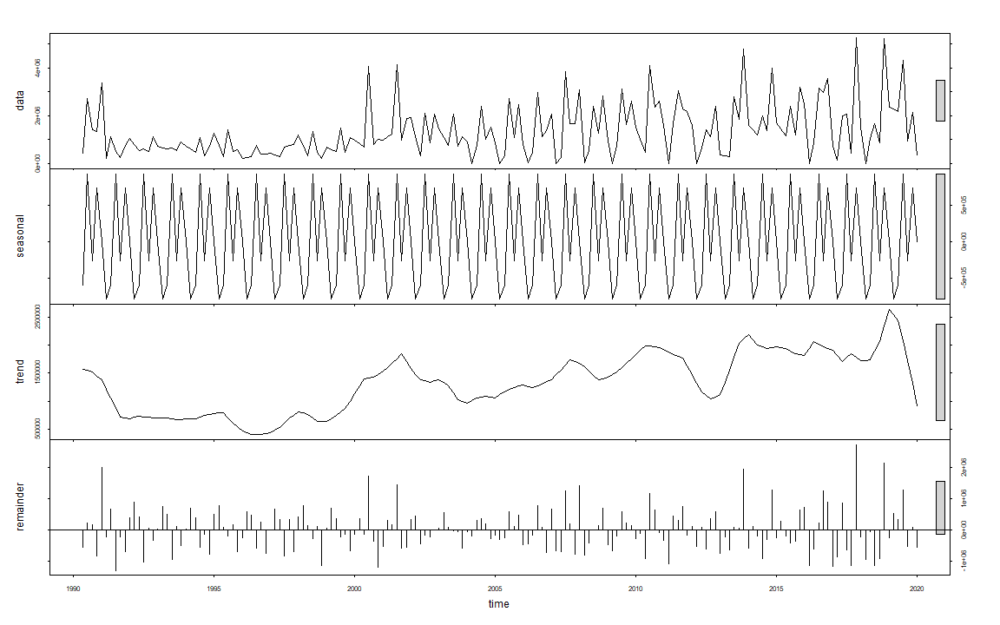
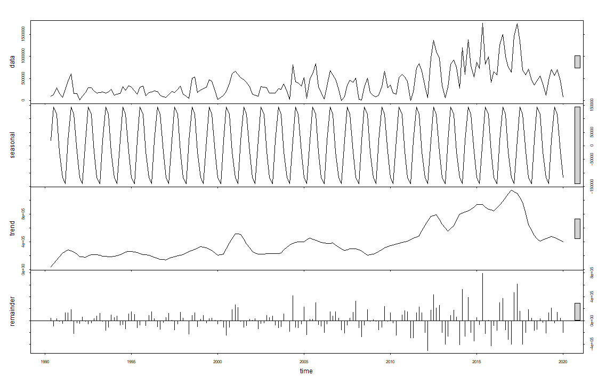
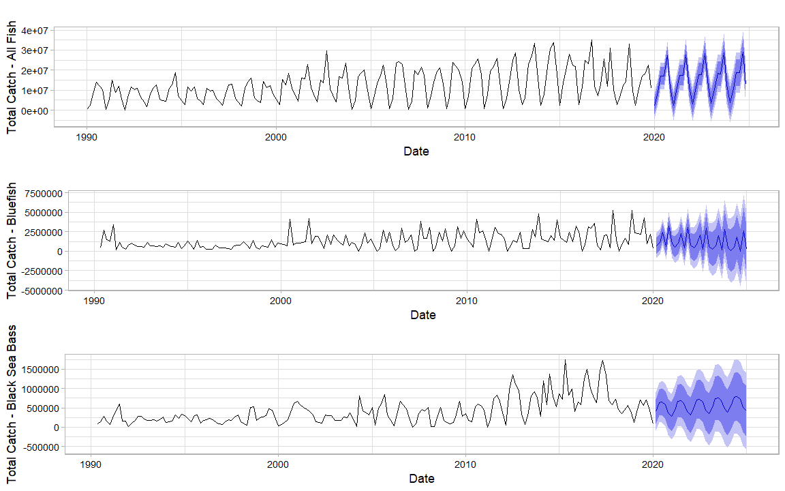

What's the Catch? Recreational Fishing Trends in North Carolina (1990-2019)
========================================================
author: Ardath Dixon, Annie Harshbarger, Eva May
date: Spring 2021
autosize: true


Data and Research Questions
========================================================  
<br />

## Data retrieved from NOAA Marine Recreational Information Program download query tool

- Bimonthly recreational fisheries catch totals for NC, 1990-2019

- All species, bluefish (*Pomatomus saltatrix*), and black sea bass (*Centropristis striata*) 

- Multiple areas and modes of fishing  

<br />

## Research questions

- Are there trends in the amount of these fish caught over time?

- Do these trends differ for bluefish, black sea bass, and all species combined?

A Preview of the Data
========================================================


 


## Original Dataset


```
# A tibble: 6 x 8
   YEAR  WAVE SUB_REG    ST    SP_CODE MODE_FX AREA_X TOT_CAT
  <dbl> <dbl>   <dbl> <dbl>      <dbl>   <dbl>  <dbl>   <dbl>
1  1990     1       6    37 8710010201       3      1 203578.
2  1990     1       6    37 8713040113       3      1   9693.
3  1990     1       6    37 8713040115       3      1   3987.
4  1990     1       6    37 8777020101       7      5 153212.
5  1990     1       6    37 8835440102       7      1  82510.
6  1990     1       6    37 8835440601       7      1  25388.
```

## Wrangled Dataset


```
        DATE TOT_CAT_ALL
1 1990-01-01    484714.5
2 1990-03-01   2485857.2
3 1990-05-01   9215674.2
4 1990-07-01  13992342.3
5 1990-09-01  11808541.6
6 1990-11-01  10354163.5
```


Total Catch 1990-2019
========================================================


Time Series Trends - All Fish
========================================================


Time Series Trends - Bluefish
========================================================



Time Series Trends - Black Sea Bass
========================================================



Monotonic Trend Analysis
========================================================

## Seasonal Mann-Kendall Test
<br />
### All species


```
tau = 0.49, 2-sided pvalue =< 2.22e-16
```

### Bluefish


```
tau = 0.324, 2-sided pvalue =8.7489e-10
```

### Black sea bass


```
tau = 0.41, 2-sided pvalue =8.4377e-15
```

<br />

For both individual species and all species combined, **reject the null hypothesis** that there is no trend.

Holt-Winters Forecasting
========================================================



Discussion
========================================================
<br />

### Strong seasonal trends
+ Bimodal peaks for bluefish
+ Possibly due to effort, fish abundance

<br />

### Overall positive trend
+ Increase in recreational fishing
+ Variation from changing regulations, behavior

Discussion
========================================================
<br />

### Limitations
+ Data collection: Estimates based on surveys of fishers 
+ Interpolation
+ Uncertainty in forecasting

<br />

### Future recommendations
+ Comparisons of other species or other states
+ Catch per unit effort
+ Include earlier data
